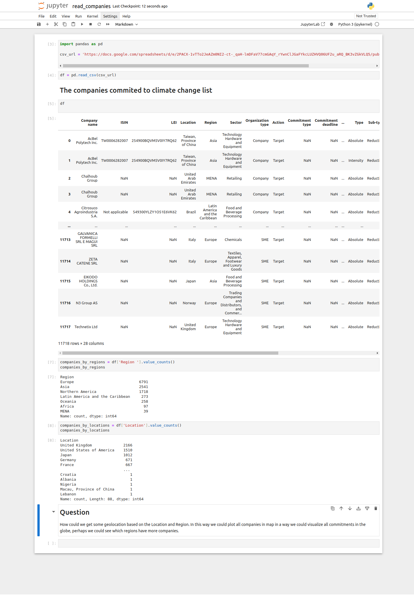

# geo-climate

## Get started

Make sure you have python +3.9 installed
Create a new python environment

```
cd your-projects
git clone https://github.com/huogerac/geo-climate.git
cd geo-climate
python -m venv .venv

```

Active the environment and install the dependencies

```
source .venv/bin/activate
pip install -r requirements.txt
```

Run the jupyter

```
jupyter notebook
```

Check the initial idea


